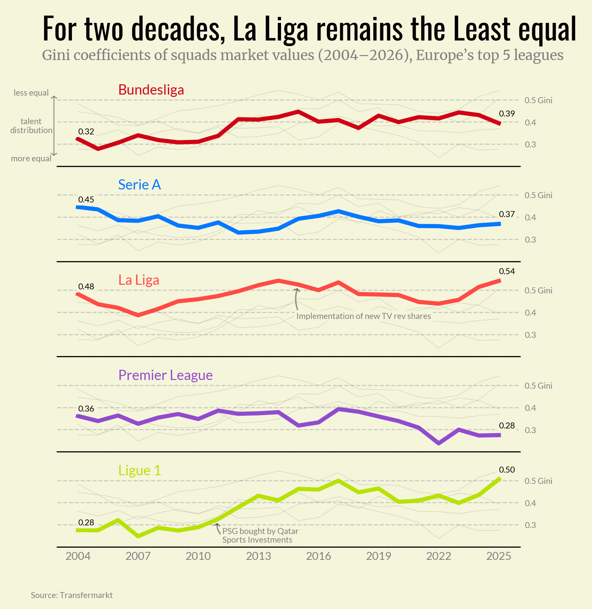
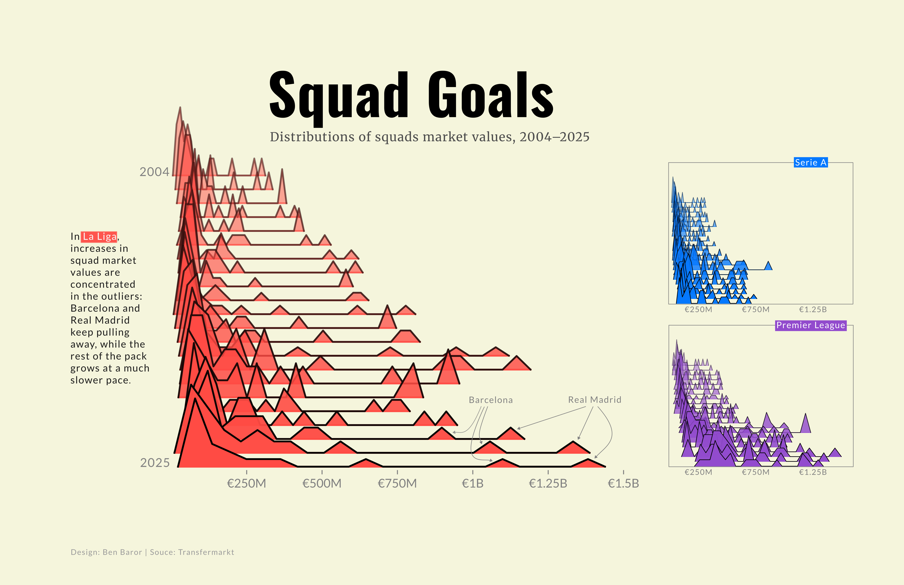
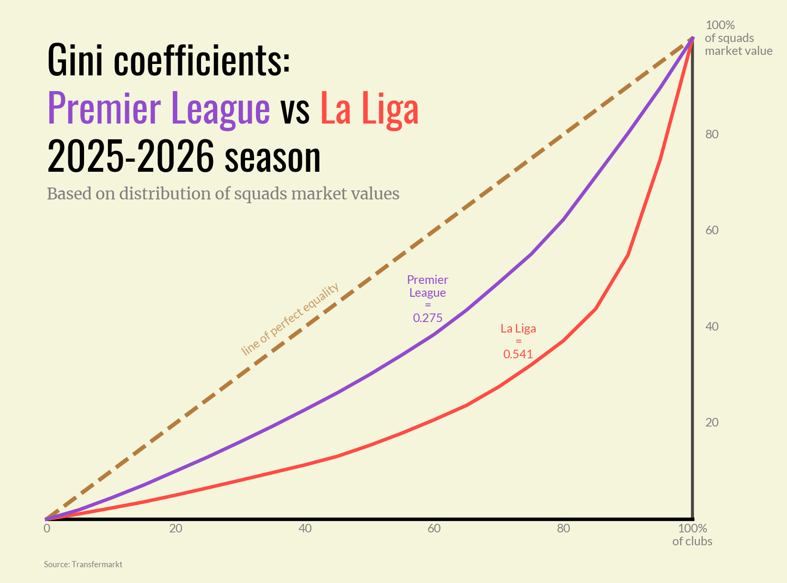
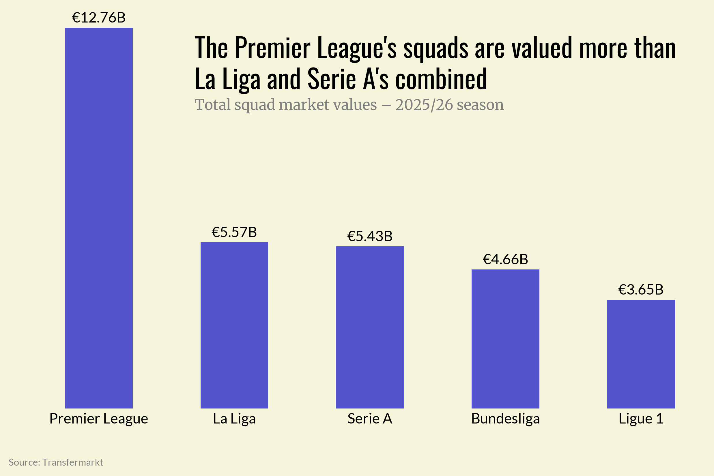

# Squad Value Inequality in Europe’s Top 5 Leagues (2004–2026)

This is a full end-to-end data project: from raw scraping → cleaned dataset → statistical analysis → visual story → [written article](https://saltyflake92.substack.com/p/mashing-football-and-data-gini-ridge).

## 🎯 Project Goals
- Scrape squad market values for Europe’s top 5 leagues (2004–2026) from Transfermarkt.
- Process and structure multi-season datasets for analysis.
- Measure and experiment with the **Gini index** outside economics.
- Visualize distributions over time using **ridge plots**.
- Explore trends in competitiveness across leagues and over time.
  

## 📊 Key Findings
- **La Liga** is consistently the **most unequal** league in squad value distribution.
- **Premier League** has become **more equal over time**, even with massive financial growth.
- **Serie A** shows a significant reduction in inequality, moving toward a more balanced distribution.
  

## 📂 Repository Contents
- [`scraping_squad_values/`](scraping_squad_values/) — Scripts for scraping Transfermarkt squad data.
- [`data/`](data/) — Cleaned and structured datasets (CSV/Parquet).
- [`notebooks/`](notebooks/) — Jupyter notebook for:
  - Data cleaning and processing
  - Data analysis
  - Gini calculations
  - Time-series, Bar charts, and Ridge plot visualizations
- [`pngs/`](pngs) — Final figures used in the article.

## 🛠 Tools
- **Python**: pandas, numpy, matplotlib, joypy  
- **Web scraping**: Scrapy
- **Jupyter Notebooks** for exploration and visualization  
- **Data source**: Transfermarkt (scraped)

